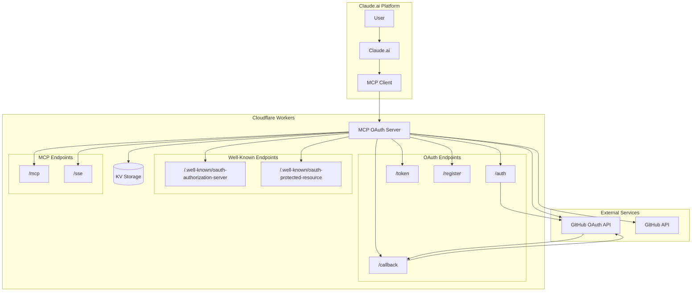
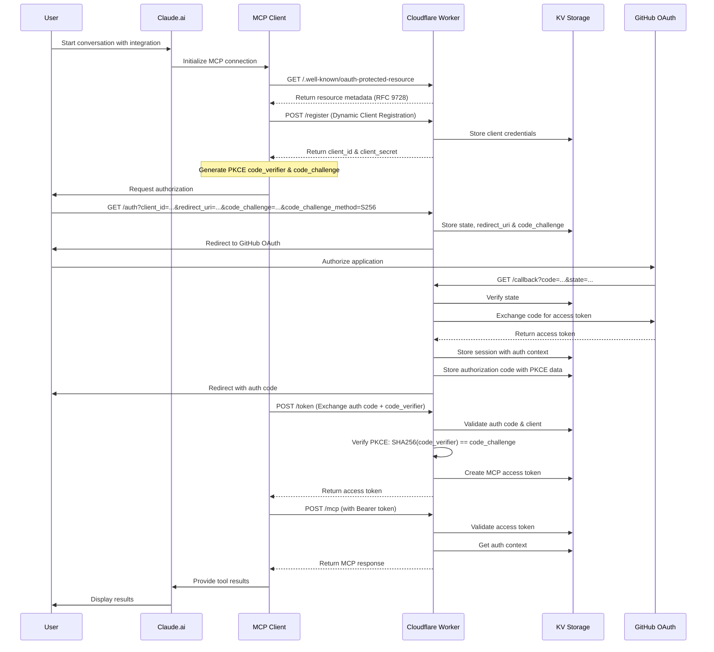

# Cloudflare Workers MCP Server with OAuth

A Model Context Protocol (MCP) server for Claude.ai custom integrations, running on Cloudflare Workers with GitHub OAuth authentication.

## Demo(Slide)

<https://slide-tubone24.pages.dev/slides/authmcp/1>

## Features

- ✅ Claude.ai Custom Integration support
- ✅ Full compliance with MCP authentication specification
- ✅ OAuth 2.0 authorization flow (GitHub)
- ✅ Dynamic Client Registration (DCR) for OAuth clients
- ✅ OAuth 2.0 Protected Resource Metadata (RFC 9728)
- ✅ Session management with KV storage
- ✅ Permission-based access control
- ✅ MCP tools for user information, calculations, and GitHub repository access

## Architecture



### Authentication Flow Sequence



## Setup

### 1. Prerequisites

- Cloudflare account
- GitHub account
- Node.js 18+
- Wrangler CLI

### 2. Setup Cloudflare Worker

Login to Cloudflare (if not already logged in)

```bash
npx wrangler auth login
```

Update the worker name in `wrangler.toml` if desired

```toml
name = "your-mcp-server-name"
```

### 3. Create GitHub OAuth App

1. Go to [GitHub Settings > Developer settings > OAuth Apps](https://github.com/settings/applications/new)
2. Create a new OAuth app:
   - **Application name**: `MCP Auth Demo`
   - **Homepage URL**: `https://your-worker.workers.dev`
   - **Authorization callback URL**: `https://your-worker.workers.dev/callback`
3. Save the Client ID and Client Secret

### 4. Create Cloudflare KV Namespace

```bash
npx wrangler kv namespace create "OAUTH_KV"
```

Update `wrangler.toml` with the generated ID:

```toml
[[kv_namespaces]]
binding = "OAUTH_KV"
id = "your-kv-namespace-id"
```

### 5. Configure Environment Variables

Set the following secrets using Wrangler CLI:

```bash
# Set GitHub OAuth credentials
wrangler secret put GITHUB_CLIENT_ID
wrangler secret put GITHUB_CLIENT_SECRET

# Set cookie encryption key (generate a random string)
wrangler secret put COOKIE_ENCRYPTION_KEY

# Optional: Restrict access to specific GitHub usernames (comma-separated)
wrangler secret put ALLOWED_USERNAMES
```

### 6. Deploy

```bash
# Install dependencies
npm install

# Deploy to Cloudflare Workers
npm run deploy
```

## Claude.ai Configuration

### Adding Custom Integration

1. Log into Claude.ai (Team/Enterprise plan required)
2. Go to Settings > Integrations
3. Click "Add Custom Integration"
4. Enter the following information:
   - **Name**: MCP Auth Demo
   - **MCP Server URL**: `https://your-worker.workers.dev/mcp`
   - **OAuth Authorization URL**: `https://your-worker.workers.dev/auth`
   - **OAuth Token URL**: `https://your-worker.workers.dev/token`
   - **Client Registration URL**: `https://your-worker.workers.dev/register`

### Usage

1. Start a new conversation in Claude
2. Enable the integration
3. When prompted, authenticate with GitHub
4. MCP tools become available

## Available Tools

### 1. `get_user_info`
Retrieves authenticated user information.

```
User: Show my user info
Claude: Using get_user_info tool...
```

### 2. `calculate`
Performs basic arithmetic calculations.

```
User: Calculate 7 to the power of 8
Claude: Using calculate tool...
```

### 3. `get_github_repos`
Lists user's GitHub repositories.

```
User: Show my GitHub repositories
Claude: Using get_github_repos tool...
```

## OAuth Endpoints

### Well-Known Endpoints

- `/.well-known/oauth-authorization-server` - OAuth 2.0 Authorization Server Metadata
- `/.well-known/oauth-protected-resource` - OAuth 2.0 Protected Resource Metadata (RFC 9728)

### OAuth Flow Endpoints

- `/auth` - Authorization endpoint
- `/callback` - OAuth callback endpoint
- `/token` - Token exchange endpoint
- `/register` - Dynamic client registration endpoint

### MCP Endpoints

- `/mcp` - HTTP POST endpoint for MCP requests
- `/sse` - Server-Sent Events endpoint for streaming

## Development

### Local Development

```bash
# Start development server
npm run dev

# Generate TypeScript types
npm run cf-typegen
```

### Testing

You can test the MCP server using the Claude Code Inspector:

1. **Start the Inspector**:
   ```bash
   npx @modelcontextprotocol/inspector https://your-worker.workers.dev/mcp
   ```

2. **Test OAuth 2.0 Metadata Endpoints**:
   - Visit `https://your-worker.workers.dev/.well-known/oauth-authorization-server`
   - Visit `https://your-worker.workers.dev/.well-known/oauth-protected-resource`
   - Verify RFC 9728 compliance

3. **Test Dynamic Client Registration**:
   ```bash
   curl -X POST https://your-worker.workers.dev/register \
     -H "Content-Type: application/json" \
     -d '{
       "client_name": "Test MCP Client",
       "redirect_uris": ["urn:ietf:wg:oauth:2.0:oob"]
     }'
   ```

4. **Test OAuth Flow** (using Inspector):
   - The Inspector will automatically handle the OAuth flow
   - Follow the GitHub authentication prompts
   - Verify successful token exchange

5. **Test MCP Tools**:
   Once authenticated, test the available tools in the Inspector:
   - `get_user_info` - Retrieve authenticated user information
   - `calculate` - Perform arithmetic operations
   - `get_github_repos` - List GitHub repositories

6. **Verify Server Health**:
   ```bash
   curl https://your-worker.workers.dev/health
   ```

The Inspector provides a comprehensive interface for testing MCP servers with OAuth authentication, making it easy to verify all functionality works correctly.


## Resources

- [MCP Specification](https://modelcontextprotocol.io/)
- [OAuth 2.0 Protected Resource Metadata (RFC 9728)](https://datatracker.ietf.org/doc/html/rfc9728)
- [Claude.ai Integrations Documentation](https://support.anthropic.com/en/articles/11175166)
- [Cloudflare Workers Documentation](https://developers.cloudflare.com/workers/)

## License

MIT License
